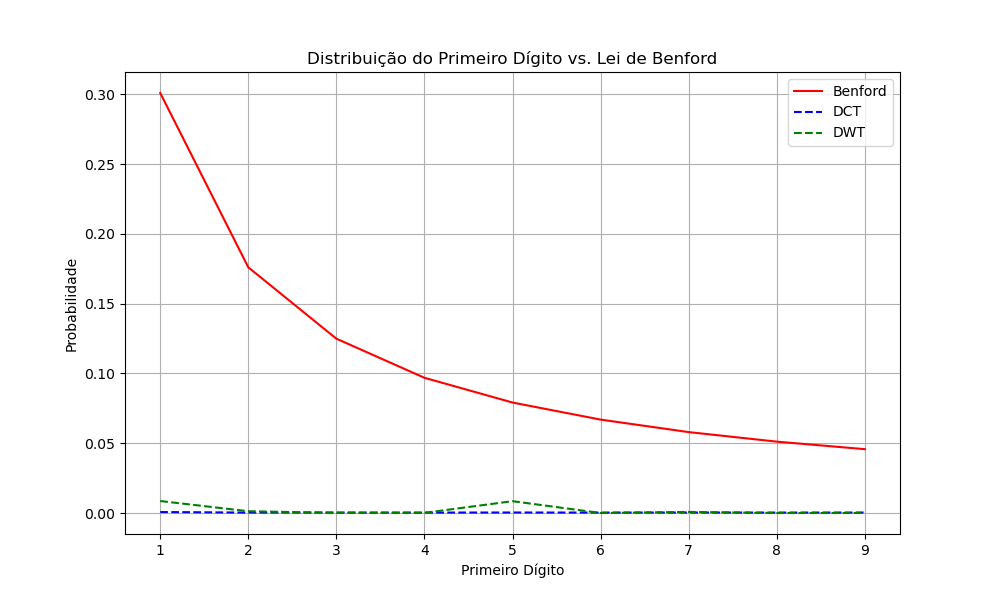

  

## Quem sou eu

Interessado em tecnologia e inovação – especialmente na área da Saúde (minha área profissional original).  

Procuro resolver problemas efetivos e transformar ideias em soluções reais.

Adepto do Lifelong Learning – o aprendizado contínuo ao longo de toda a vida.
 
 

 

 

 
 

## Tecnologias que uso

  <!-- Primeira linha de badges -->
  
  
  
  
  
  
  
   
  <!-- Segunda linha de badges -->

  
  
  
  
  
  

 
 

## Atualmente estou...

1. Aprendendo sobre Inteligência Artificial, especialmente Deep Learning;
2. Trabalhando em projetos pessoais para ampliar meu portfólio;
3. Atuando em um projeto comercial de automação na área da saúde.

 
 

## Estou cursando atualmente:

1. **Hashtag Treinamentos:** Inteligência Artificial.
2. **Data Science Academy Brasil:** Formação Inteligência Artificial Para Medicina.
3. **Asimov Academy:** Python para IA - Do Zero Ao Primeiro Chatbot.
4. **Escola de Inteligência Artificial:** Formação Completa em Inteligência Artificial e Machine Learning.
5. **Cursa (Universo Discreto):** Redes Neurais e Deep Learning com Python.
6. **Google:** Curso Intensivo de Machine Learning.

 
 

## Projetos Destacados

### 🔍 Detector de Imagens Adulteradas (Lei de Benford).

Desenvolvi um algoritmo simples em Python, que analisa imagens digitais aplicando a Lei de Benford para determinar a probabilidade de uma imagem ser natural ou ter sido adulterada digitalmente (ou criada por IA).

  

**[Ver código completo.](https://https://github.com/deldotore-r/benford_01)**

A Lei de Benford estabelece que em muitos conjuntos de dados naturais, a frequência do primeiro dígito segue uma distribuição logarítmica. O código verifica se os pixels de uma imagem seguem esta distribuição, identificando possíveis manipulações.

**Tecnologias:** Python, OpenCV, NumPy, Matplotlib

 
 

## Como me encontrar

  <!--
--><!--
-->

  Na Era da IA, o Lifelong Learning não é uma escolha: é a única opção.

