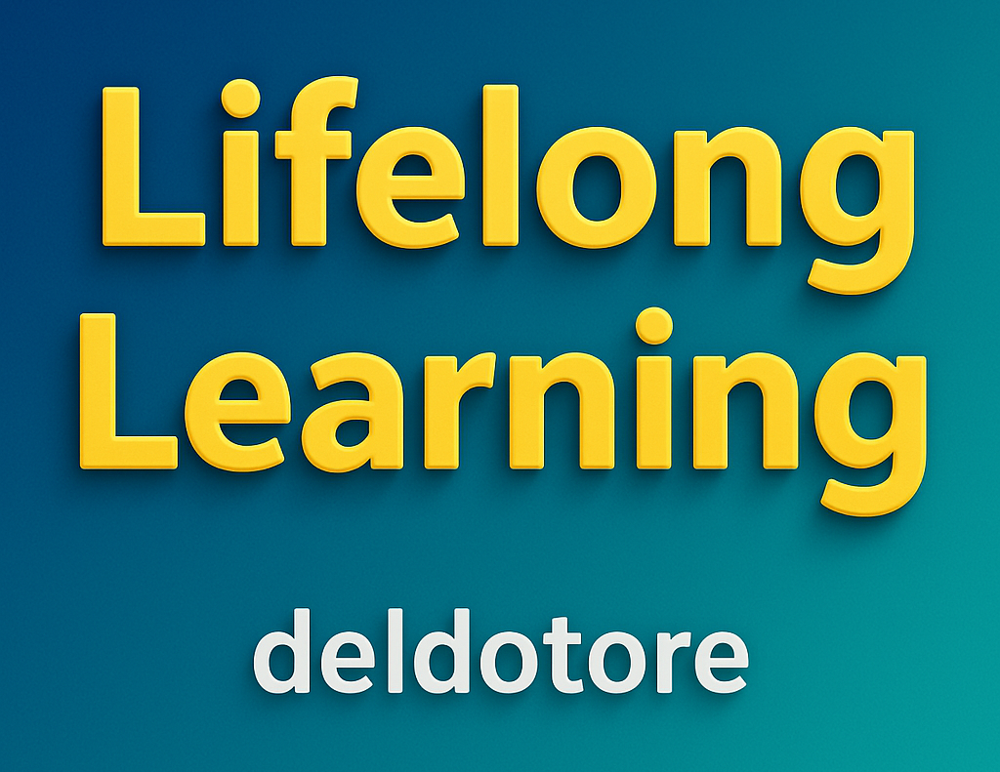
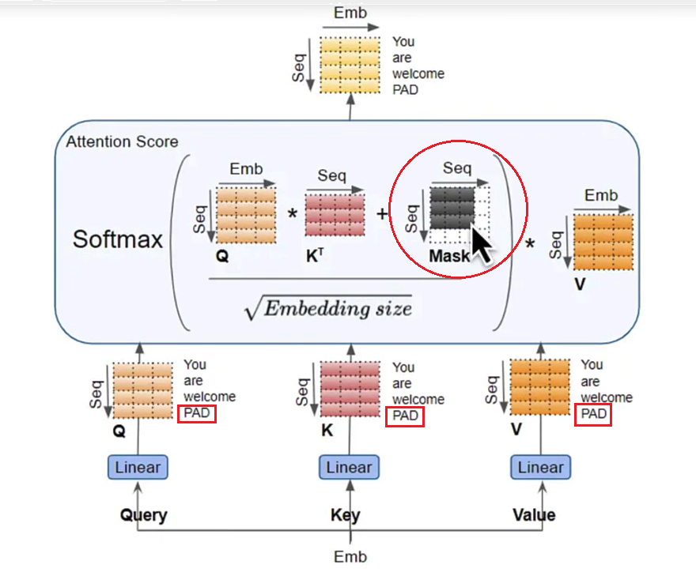
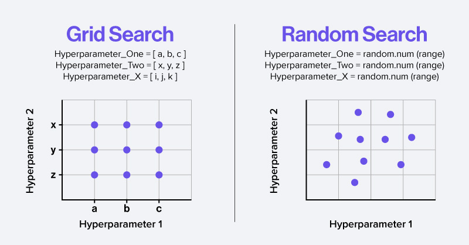
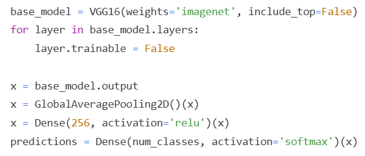
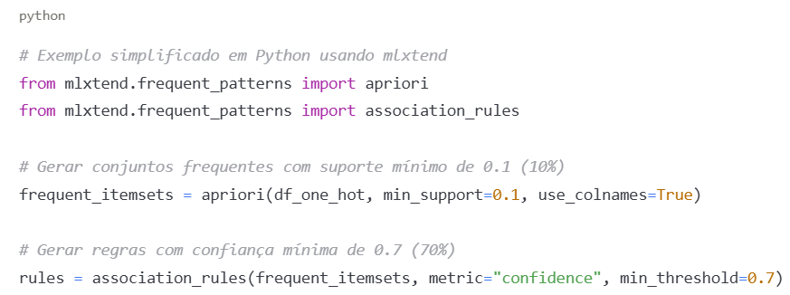
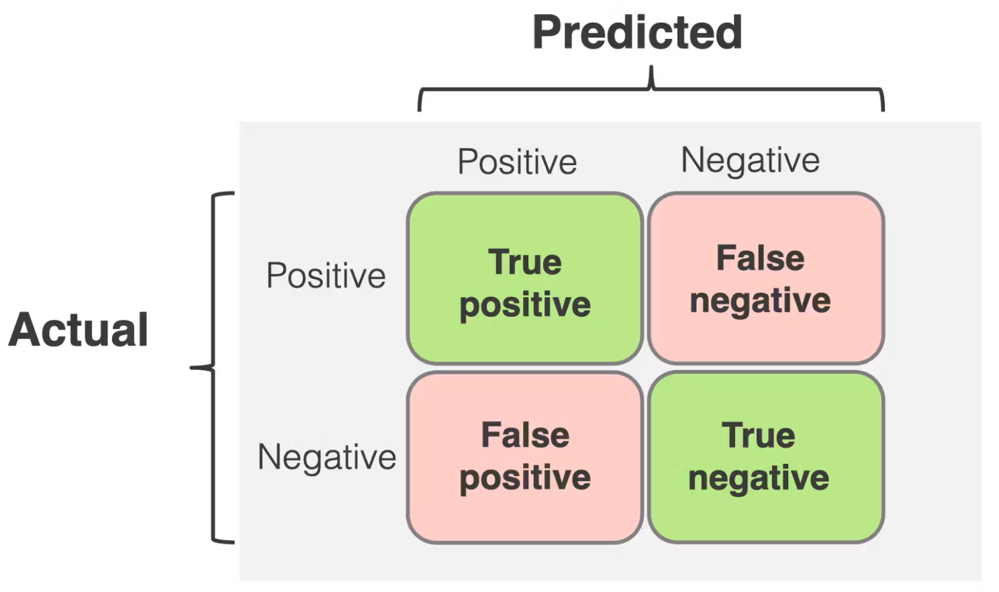
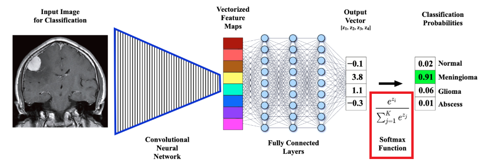
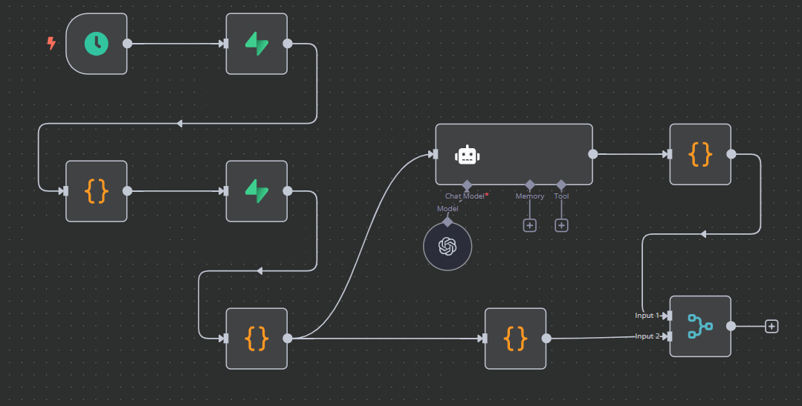
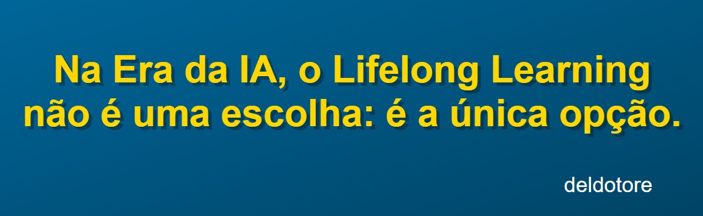

  

 

## 1. Quem sou eu:

 
 

🔹 Visão Geral: Militar aposentado migrando para a Tecnologia da Informação.

🔹 Lifelong Learner: Adepto do aprendizado contínuo, independente da fase da vida.

 
 

## 2. Estatísticas no Github:

 
 

 

 

  
 
 

## 3. Tecnologias e ferramentas: 

 
 

  <!-- Primeira linha de badges -->
  
  
  
  
  
  
  
  
  

   
  <!-- Segunda linha de badges -->

  
  
  
  
  
  

  https://img.shields.io/badge/Airflow-017CEE?style=for-the-badge&logo=Apache%20Airflow&logoColor=white
  

 
 

## 4. Projetos de estudo:

 
 

4.1. 🚀 Detector de Imagens Adulteradas (Lei de Benford): repositório no Github. 

 

  

A Lei de Benford estabelece que em muitos conjuntos de dados naturais, a frequência do primeiro dígito segue uma distribuição logarítmica. O código verifica se os pixels de uma imagem seguem esta distribuição, identificando possíveis manipulações.

**[Ver código completo.](https://github.com/deldotore-r/benford_01)**

  

 
 

4.2. 📖 Modelos Transformers - Máscaras de Atenção: artigo no LinkedIn. 

 

  

O papel crítico das máscaras de atenção - o mecanismo que permite aos modelos de IA (como o GPT) processarem informações de forma eficiente e gerar texto coerente. 

[Ler o artigo completo.](https://www.linkedin.com/pulse/m%C3%A1scaras-de-aten%C3%A7%C3%A3o-em-transformers-fun%C3%A7%C3%B5es-e-reinaldo-del-dotore-wka0f)

  

 
 

4.3. 📖 Seleção de Hiperparâmetros em ML: artigo no LinkedIn. 

 

  

Nesse artigo, discuto três técnicas de seleção de hiperparâmetros para Machine Learning, utilizando um simples Perceptron como modelo. 

[Artigo completo no LinkedIn](https://www.linkedin.com/pulse/sele%C3%A7%C3%A3o-de-hiperpar%C3%A2metros-em-machine-learning-da-ao-del-dotore-xsnyf).

  

 
 

4.4. 📖 Transfer Learning em CNNs: artigo no LinkedIn. 

 

  

O Transfer Learning está revolucionando a forma como são treinados os modelos de inteligência artificial, permitindo que o conhecimento adquirido em uma tarefa seja reaproveitado para outra. 

[Aqui, o artigo no LinkedIn.](https://www.linkedin.com/pulse/transfer-learning-em-cnns-aproveitando-o-poder-de-reinaldo-del-dotore-qv2tf/?trackingId=WDTsbewD8YHqC522mNp85w%3D%3D) 

  

 
 

4.5. 📖 Algoritmo Apriori - desbloqueando padrões ocultos em grandes conjuntos de dados: artigo no LinkedIn. 

 

  

O algoritmo Apriori - uma abordagem elegante e eficiente para a descoberta de padrões frequentes em conjuntos de dados.

[Leia o artigo no LinkedIn.](https://www.linkedin.com/pulse/algoritmo-apriori-desbloqueando-padr%C3%B5es-ocultos-em-de-del-dotore-5jsle/?trackingId=hX0rHAzjFIMv2gUo7VWvww%3D%3D) 

  

 
 

4.6. 📖 Recall - a métrica-chave em modelos de classificação para diagnóstico médico: artigo no LinkedIn. 

 

  

A preponderância do Recall como métrica principal em sistemas de classificação para diagnóstico médico não é apenas uma preferência estatística, mas uma obrigação clínica fundamentada em princípios médicos, éticos e matemáticos.

[Artigo no LinkedIn.](https://www.linkedin.com/pulse/algoritmo-apriori-desbloqueando-padr%C3%B5es-ocultos-em-de-del-dotore-5jsle/?trackingId=hX0rHAzjFIMv2gUo7VWvww%3D%3D) 

  

 
 

4.7. 📖 A função Softmax - transformando valores em probabilidades: artigo no LinkedIn. 

 

  

Essencialmente, a função Softmax transforma um vetor de números reais em uma distribuição de probabilidades. Ela parte de valores que podem ser muito distantes entre si (positivos ou negativos) e converte em valores entre 0 e 1, fazendo com que a soma de todos os valores seja exatamente 1 (ou 100%).

[Artigo completo.](https://www.linkedin.com/pulse/fun%C3%A7%C3%A3o-softmax-transformando-valores-em-reinaldo-del-dotore-teypf/?trackingId=IPKKN704W6iaB93onmkoOA%3D%3D) 

4.8. 🌐 Site institucional do Rotary Club da Guarda. 

 

  

Como parte dos meus estudos sobre desenvolvimento web, criei o site institucional do Rotary Club da Guarda, utilizando apenas HTML, CSS e JavaScript.

[Site completo](https://rotaryclubguarda.org/) 

 
 
 

## 5. Projetos de trabalho:

 
 

5.1. 🤖 Automação na Área da Saúde. 

-  Cliente: 🤐 
-  Ferramentas: n8n, Python, Supabase. 
-  Escopo: detecção em tempo real de inconsistências em bancos de dados.

Desenvolvimento de workflow que detecta em tempo real lançamentos inconsistentes em banco de dados, inconsistências que potencialmente interferem no resultado da empresa.

 

  

 
 
 

## 6. 📖 Educação continuada.

 
 

1. **Hashtag Treinamentos:** Inteligência Artificial.
2. **Data Science Academy Brasil:** Formação Inteligência Artificial Para Medicina.
3. **Asimov Academy:** Python para IA.
4. **Escola de Inteligência Artificial:** Formação Completa em Inteligência Artificial e Machine Learning.
5. **Cursa (Universo Discreto):** Redes Neurais e Deep Learning com Python.
6. **Google:** Curso Intensivo de Machine Learning.

  

 
 

## Como me encontrar

  &#8202;
  &#8202;
  &#8202;
  

 
 

  

