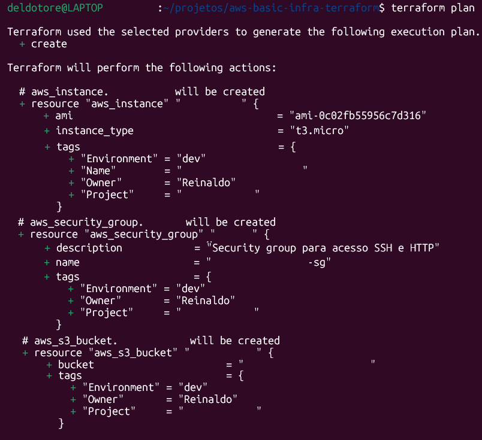

# Reinaldo Del Dotore — Cloud | DevOps | Infraestrutura como Código

  

## 1. Quem sou eu:

🔹 **Visão Geral:** Profissional em transição da área militar para tecnologia, com foco em Cloud, Infraestrutura como Código e Engenharia de Dados. Trago 30 anos de experiência em liderança e processos críticos, agora aplicados em soluções de automação e eficiência operacional com tecnologias modernas.

Nos últimos anos, venho me dedicando de forma autodidática ao estudo e prática em:

- Python (automação e manipulação de dados)
- SQL (consultas e análise de dados)
- Docker e Airflow (orquestração de workflows e pipelines)
- Supabase e n8n (integração e automação de processos)
- Engenharia de dados (ETL, ELT, cloud, etc.)
- Terraform (Infraestrutura como Código)
- Ansible (gerenciamento de infraestrutura cloud)
- Cloud AWS (provedor de cloud com maior market share)

🎯 **Minha proposta de valor:** não me defino como engenheiro de software ou de dados, mas como um solucionador de problemas técnicos, capaz de aprender rápido, estruturar processos e entregar resultados práticos.

🔹 **Lifelong Learner:** Adepto do aprendizado contínuo, independentemente da fase da vida.

## 2. Estatísticas no Github:

Meu GitHub reflete uma rotina constante de estudos e prática técnica — projetos reais, experimentos e automações.

## 3. Tecnologias e ferramentas:

  
  
  
  
  
  
  
   
  
  
  
  
  
  
  
  

## 4. Projetos de estudo:

Meus projetos refletem aplicação prática de ciência de dados, aprendizado de máquina e automação, desenvolvidos de forma independente.

### 4.1. 🚀 Detector de Imagens Adulteradas (Lei de Benford)

  

A Lei de Benford estabelece que em muitos conjuntos de dados naturais, a frequência do primeiro dígito segue uma distribuição logarítmica. O código verifica se os pixels de uma imagem seguem esta distribuição, identificando possíveis manipulações.

**[Ver código completo](https://github.com/deldotore-r/benford_01)**

---

### 4.2. 📖 Modelos Transformers - Máscaras de Atenção

  

O papel crítico das máscaras de atenção — o mecanismo que permite aos modelos de IA (como o GPT) processarem informações de forma eficiente e gerar texto coerente. 

[Ler o artigo completo](https://www.linkedin.com/pulse/m%C3%A1scaras-de-aten%C3%A7%C3%A3o-em-transformers-fun%C3%A7%C3%B5es-e-reinaldo-del-dotore-wka0f)

---

### 4.3. 📖 Seleção de Hiperparâmetros em ML

  

Discussão de três técnicas de seleção de hiperparâmetros para Machine Learning, utilizando um simples Perceptron como modelo. 

[Artigo completo no LinkedIn](https://www.linkedin.com/pulse/sele%C3%A7%C3%A3o-de-hiperpar%C3%A2metros-em-machine-learning-da-ao-del-dotore-xsnyf)

---

### 4.4. 📖 Transfer Learning em CNNs

  

O Transfer Learning permite reaproveitar conhecimento adquirido em uma tarefa para outra, revolucionando o treinamento de modelos de IA. 

[Aqui, o artigo no LinkedIn](https://www.linkedin.com/pulse/transfer-learning-em-cnns-aproveitando-o-poder-de-reinaldo-del-dotore-qv2tf/?trackingId=WDTsbewD8YHqC522mNp85w%3D%3D)

---

### 4.5. 📖 Algoritmo Apriori - desbloqueando padrões ocultos

  

Descoberta de padrões frequentes em grandes conjuntos de dados usando o algoritmo Apriori.

[Leia o artigo no LinkedIn](https://www.linkedin.com/pulse/algoritmo-apriori-desbloqueando-padr%C3%B5es-ocultos-em-de-del-dotore-5jsle/?trackingId=hX0rHAzjFIMv2gUo7VWvww%3D%3D)

---

### 4.6. 📖 Recall - métrica-chave em modelos de classificação

  

A preponderância do Recall como métrica principal em sistemas de classificação para diagnóstico médico não é apenas uma preferência estatística, mas uma obrigação clínica fundamentada em princípios médicos, éticos e matemáticos.

[Artigo no LinkedIn](https://www.linkedin.com/pulse/recall-a-m%C3%A9trica-chave-em-modelos-de-classifica%C3%A7%C3%A3o-reinaldo-del-dotore/)

---

### 4.7. 📖 A função Softmax - transformando valores em probabilidades

  

A função Softmax transforma um vetor de números reais em uma distribuição de probabilidades, convertendo valores positivos e negativos em valores entre 0 e 1, de forma que a soma seja 1 (ou 100%).

[Artigo completo](https://www.linkedin.com/pulse/fun%C3%A7%C3%A3o-softmax-transformando-valores-em-reinaldo-del-dotore-teypf/?trackingId=IPKKN704W6iaB93onmkoOA%3D%3D)

---

### 4.8. 🌐 Site institucional do Rotary Club da Guarda

  

Como parte dos meus estudos sobre desenvolvimento web, criei o site institucional do Rotary Club da Guarda, utilizando apenas HTML, CSS e JavaScript.

[Site completo](https://rotaryclubguarda.org/)

---

### 4.9. ☁️ Infraestrutura como Código na AWS (Terraform)

  

Primeiro projeto público voltado para Cloud e DevOps, criando uma infraestrutura completa na AWS — EC2, Security Group e S3 — totalmente automatizada via Terraform.  

[🔗 Repositório no GitHub](https://github.com/deldotore-r/aws-basic-infra-terraform)

---

## 5. Projetos de trabalho

Projetos reais desenvolvidos sob demanda, voltados à automação, integração de dados e eficiência operacional. Por questões de confidencialidade, detalhes técnicos sensíveis são omitidos.

### 5.1. 🤖 Automação na Área da Saúde

- **Cliente:** Confidencial (projeto privado)  
- **Ferramentas:** n8n, Python, Supabase  
- **Escopo:** detecção em tempo real de inconsistências em bancos de dados  

Desenvolvimento de workflow que detecta lançamentos inconsistentes em tempo real, que potencialmente interferem nos resultados da empresa.

  

---

## Como me encontrar

  
  
  

---

  

